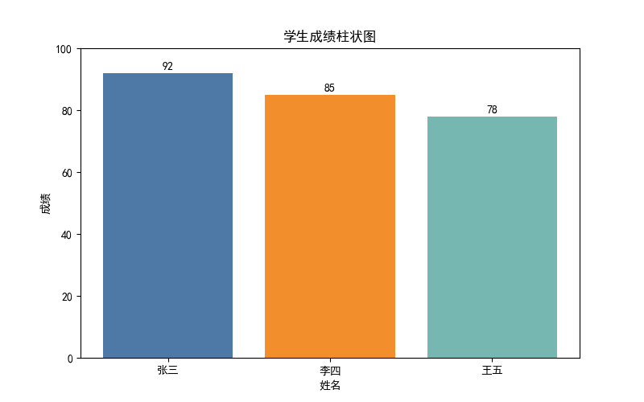
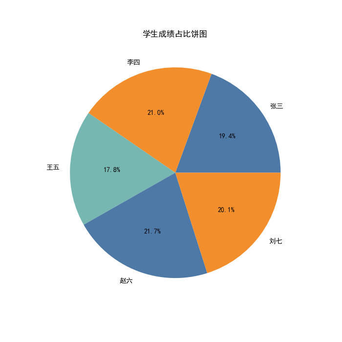
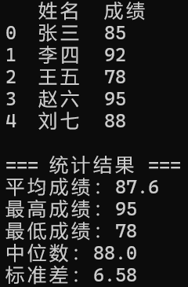

# 2026-ai-basics-practice

**大一下人工智能应用基础课程个人实践项目**  
（2025-2026 学年上学期 · 已开源）

## 项目简介

使用 Python + pandas + matplotlib 实现学生成绩数据的读取、统计分析与可视化。  
支持从 CSV 文件读取任意数量的学生数据，计算多种统计指标，并生成柱状图和饼图。

## 技术栈

- Python 3.11
- conda 环境：bigdata
- 依赖库：pandas, matplotlib

## 运行方法
**注意**：  
- 项目已附带 `students.csv` 示例数据文件，可直接运行测试。  
- 支持任意数量的学生数据（CSV 行数不限，图表自动适应）。  
- 运行后会自动生成 `analysis_results.xlsx` 文件（统计结果表格）。

**项目结构说明**：
- `code/` 文件夹：主代码文件（成绩分析.py）
- `students.csv`：示例数据（5名学生）
- `analysis_results.xlsx`：运行后自动生成的统计报告
- `notes/` 和 `report/`：个人学习笔记和报告（仅供参考）

**台式机/WSL 运行说明**：
项目已完美同步到台式机 WSL Ubuntu 环境（虚拟环境 venv 已创建）。
运行命令：
```bash
cd /mnt/d/BigdataLearning/2025-2026-2学期/人工智能应用基础/code
source venv/bin/activate
python3 "成绩分析.py" 

1. 激活环境：
   ```bash
   conda activate bigdata
   ```

2. 进入项目文件夹并运行：
   ```bash
   cd "D:\BigdataLearning\2025-2026-2学期\人工智能应用基础\code"
   python "成绩分析.py"
   ```

**示例数据**：仓库已附带 `students.csv`（5 名学生），可直接运行测试。  
支持任意数量的学生数据（CSV 文件行数不限，图表自动适应）。

## 运行效果截图（CSV 版本）

### 柱状图（学生成绩分布）


### 饼图（成绩占比）


### 终端输出示例（读取 CSV 后）


*以上为使用 students.csv 示例数据运行的结果*

## 项目亮点

- 支持 CSV 文件读取（真实数据分析）
- 计算完整统计指标（平均分、最高分、最低分、中位数、标准差）
- 中文图表显示正常（已解决 matplotlib 乱码）
- 代码结构清晰，注释详细，适合初学者学习
- 完整 GitHub 项目流程（代码 + README + 运行截图）

## 未来计划

- 支持导出统计结果为 Excel 报告
- 添加成绩分段统计（优秀/良好/及格/不及格）
- 使用 seaborn 美化图表
- 尝试集成简单异常检测

欢迎 Star & Fork！
